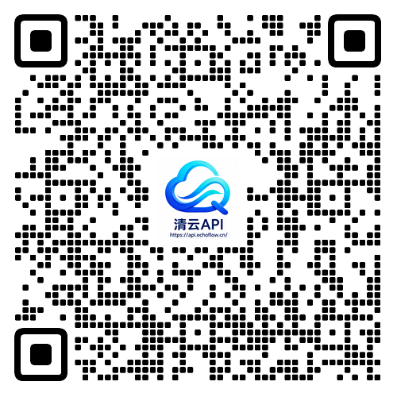

# EchoFlowAI-Claude-Code

<p align="center">
  
</p>

<div align="center">

[](https://github.com/LiuGuangHS/EchoFlowAI-Claude-Code/stargazers)
[](https://github.com/LiuGuangHS/EchoFlowAI-Claude-Code/network/members)
[](https://github.com/LiuGuangHS/EchoFlowAI-Claude-Code/issues)
[](https://github.com/LiuGuangHS/EchoFlowAI-Claude-Code/pulls)
[](https://github.com/LiuGuangHS/EchoFlowAI-Claude-Code/blob/main/LICENSE)
[](README.md)
[](README.en.md)
[](https://liuguanghs.github.io/EchoFlowAI-Claude-Code/)

</div>

A Claude Code build repaired from the source leaked from Anthropic's npm registry on 2026-03-31. EchoFlowAI-Claude-Code is now primarily a **desktop Claude Code workspace** for macOS and Windows: sessions, projects, branch / Worktree launch, right-side file changes, code diffs, permission review, provider setup, Computer Use, H5 remote access, IM integration, and scheduled tasks in one app.

<p align="center">
  <a href="#desktop-preview">Desktop Preview</a> · <a href="#install-the-desktop-app">Install</a> · <a href="#desktop-highlights">Highlights</a> · <a href="#feedback--sponsorship">Feedback</a> · <a href="#more-documentation">More Docs</a>
</p>

---

## Desktop Preview

The EchoFlowAI-Claude-Code desktop app brings sessions, multi-project navigation, branch / Worktree controls, right-side file changes, code diffs, permission review, provider setup, and remote access into one graphical workspace for daily development flows beyond the terminal.

<p align="center">
  <a href="https://github.com/LiuGuangHS/EchoFlowAI-Claude-Code/releases"></a>
  &nbsp;
  <a href="docs/desktop/04-installation.md"></a>
</p>

<table>
  <tr>
    <td align="center" width="25%"><br><b>Desktop Workspace</b></td>
    <td align="center" width="25%"><br><b>Right-side Changes & Worktree</b></td>
    <td align="center" width="25%"><br><b>Code Editing & Diff View</b></td>
    <td align="center" width="25%"><br><b>Permission Review & AI Questions</b></td>
  </tr>
  <tr>
    <td align="center" width="25%"><br><b>H5 Remote Access</b></td>
    <td align="center" width="25%"><br><b>Token Usage</b></td>
    <td align="center" width="25%"><br><b>Computer Use</b></td>
    <td align="center" width="25%"><br><b>Scheduled Tasks</b></td>
  </tr>
</table>

---

## Install the Desktop App

1. Download the macOS or Windows desktop installer from [Releases](https://github.com/LiuGuangHS/EchoFlowAI-Claude-Code/releases).
2. On first launch, configure your model provider, API key, and default model in Settings.
3. If macOS blocks the app on first open, follow the [desktop installation guide](docs/desktop/04-installation.md) for Gatekeeper steps.

## Run the CLI from Source

For users who want to debug the underlying CLI, server, or local development flow:

```bash
bun install
cp .env.example .env
./bin/claude-haha
```

See [environment variables](docs/en/guide/env-vars.md) and [global usage](docs/en/guide/global-usage.md) for more configuration options.

---

## Desktop Highlights

- **Multi-session workspace**: tabs, project switching, terminal entry, and session history in one place.
- **Branch / Worktree launch**: choose a repository branch and decide whether to use the current working tree or an isolated Worktree.
- **Right-side file changes**: review changed files, added/removed lines, and current workspace state while chatting.
- **Visual code changes**: inspect edits, file writes, and diffs directly in the desktop app.
- **Permission review**: approve risky commands, tool calls, and model follow-up questions in the GUI.
- **Multi-provider setup**: configure Anthropic-compatible APIs, third-party models, WebSearch fallback, and local options.
- **Computer Use**: let the agent take screenshots, click, type, and control desktop apps after authorization.
- **H5 remote access**: open the current desktop session from a phone or another device with a one-time token.
- **IM integration**: chat, switch projects, and approve actions through Telegram / Feishu / WeChat / DingTalk.
- **Scheduled tasks and usage stats**: create planned tasks and track local token usage trends.

---

## More Documentation

| Document | Description |
|------|------|
| [Environment Variables](docs/en/guide/env-vars.md) | Full env var reference and configuration methods |
| [Third-Party Models](docs/en/guide/third-party-models.md) | Using OpenAI / DeepSeek / Ollama and other non-Anthropic models |
| [Contributing](docs/en/guide/contributing.md) | Local tests, live model baselines, PR gates, and release gates |
| [Memory System](docs/memory/01-usage-guide.md) | Cross-session persistent memory usage and implementation |
| [Multi-Agent System](docs/agent/01-usage-guide.md) | Agent orchestration, parallel tasks and Teams collaboration |
| [Skills System](docs/skills/01-usage-guide.md) | Extensible capability plugins, custom workflows and conditional activation |
| [IM Integration](docs/im/) | Remote chat, project switching, and permission approval via Telegram / Feishu / WeChat / DingTalk |
| [Computer Use](docs/en/features/computer-use.md) | Desktop control (screenshots, mouse, keyboard) — [Architecture](docs/en/features/computer-use-architecture.md) |
| [Desktop App](docs/desktop/) | Tauri 2 + React GUI client — [Quick Start](docs/desktop/01-quick-start.md) \| [Architecture](docs/desktop/02-architecture.md) \| [Installation](docs/desktop/04-installation.md) |
| [Global Usage](docs/en/guide/global-usage.md) | Run claude-haha from any directory |
| [FAQ](docs/en/guide/faq.md) | Common error troubleshooting |
| [Source Fixes](docs/en/reference/fixes.md) | Fixes compared with the original leaked source |
| [Project Structure](docs/en/reference/project-structure.md) | Code directory structure |

---

## Feedback & Sponsorship

EchoFlowAI-Claude-Code improves around real user workflows. Installation, provider setup, desktop usage, fork customization, and enterprise integration feedback are all welcome. Feature suggestions, case studies, sponsorship, custom integration, and business collaboration are welcome too.

<table>
  <tbody>
    <tr>
      <td width="34%" align="center" valign="top">
        <br>
        <strong>Feedback, Sponsorship, Collaboration</strong><br>
        <sub>Feature ideas / sponsorship / custom integration / business</sub>
      </td>
      <td width="33%" align="center" valign="top">
        <br>
        <strong>Qingyun AI VibeCoding Community</strong><br>
        <sub>AI Coding / Claude Code forks / engineering automation</sub>
      </td>
      <td width="33%" align="center" valign="top">
        <br>
        <strong>Qingyun AIGC Community</strong><br>
        <sub>AIGC tools / model apps / content workflows / industry cases</sub>
      </td>
    </tr>
  </tbody>
</table>

| What you get in the groups | Best for |
|---|---|
| Faster feedback loop | Installation failures, provider setup, model calls, and desktop issues with screenshots or logs |
| Forking experience | White-labeling, private API providers, internal distribution, Tauri packaging, releases |
| Update signals | Important fixes, prereleases, configuration changes, and practical cases |
| Peer learning | AI Coding, AIGC toolchains, automation workflows, and enterprise adoption |

You can also file reproducible issues on GitHub. Clear steps, logs, OS version, and expected behavior make issues easier to resolve.

---

## Tech Stack

| Category | Technology |
|------|------|
| Language | TypeScript |
| Desktop app | Tauri 2 |
| Desktop UI | React + Vite |
| Local runtime | [Bun](https://bun.sh) |
| Terminal UI | React + [Ink](https://github.com/vadimdemedes/ink) |
| CLI parsing | Commander.js |
| API | Anthropic SDK |
| Protocols | MCP, LSP |

## Thanks

Thanks to the original project, open-source projects, and community practices that made this work possible:

- [Anthropic Claude Code](https://www.anthropic.com/claude-code): this repository is a learning-oriented repair and fork based on Claude Code source leaked from the Anthropic npm registry on 2026-03-31. The original source code, trademarks, and related copyrights belong to Anthropic and their respective rights holders.
- [cc-haha](https://github.com/NanmiCoder/cc-haha): thanks to the cc-haha project for its continued work on the desktop workspace, provider management, documentation structure, and engineering practices. This fork builds on it with EchoFlowAI-Claude-Code branding and customization.
- [React](https://github.com/facebook/react): frontend engineering and component-based UI ecosystem.
- [Tauri](https://github.com/tauri-apps/tauri): cross-platform desktop app capabilities and engineering practices.
- [cc-switch](https://github.com/farion1231/cc-switch): reference for model provider configuration.

EchoFlowAI-Claude-Code is provided for learning, research, and internal engineering practice. If any content in this repository affects your rights, please contact us through the channels above.

---

## ⭐ Star History

If this project helps you, please support it with a ⭐ Star so more people can discover EchoFlowAI-Claude-Code.

<a href="https://www.star-history.com/#LiuGuangHS/EchoFlowAI-Claude-Code&Date">
  <picture>
    <source media="(prefers-color-scheme: dark)" srcset="https://api.star-history.com/svg?repos=LiuGuangHS/EchoFlowAI-Claude-Code&type=Date&theme=dark" />
    <source media="(prefers-color-scheme: light)" srcset="https://api.star-history.com/svg?repos=LiuGuangHS/EchoFlowAI-Claude-Code&type=Date" />
    
  </picture>
</a>

---

## Disclaimer

This repository is based on the Claude Code source leaked from the Anthropic npm registry on 2026-03-31. All original source code copyrights belong to [Anthropic](https://www.anthropic.com). It is provided for learning and research purposes only.
