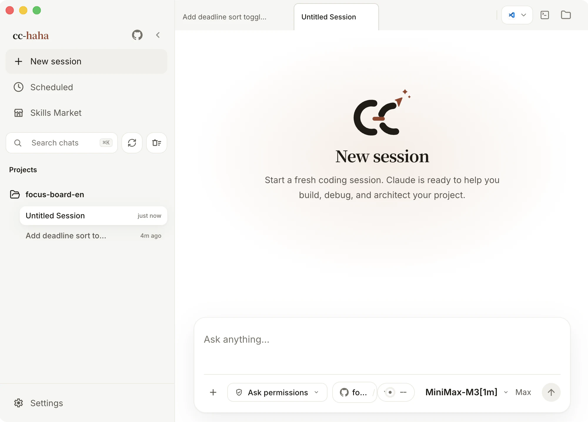
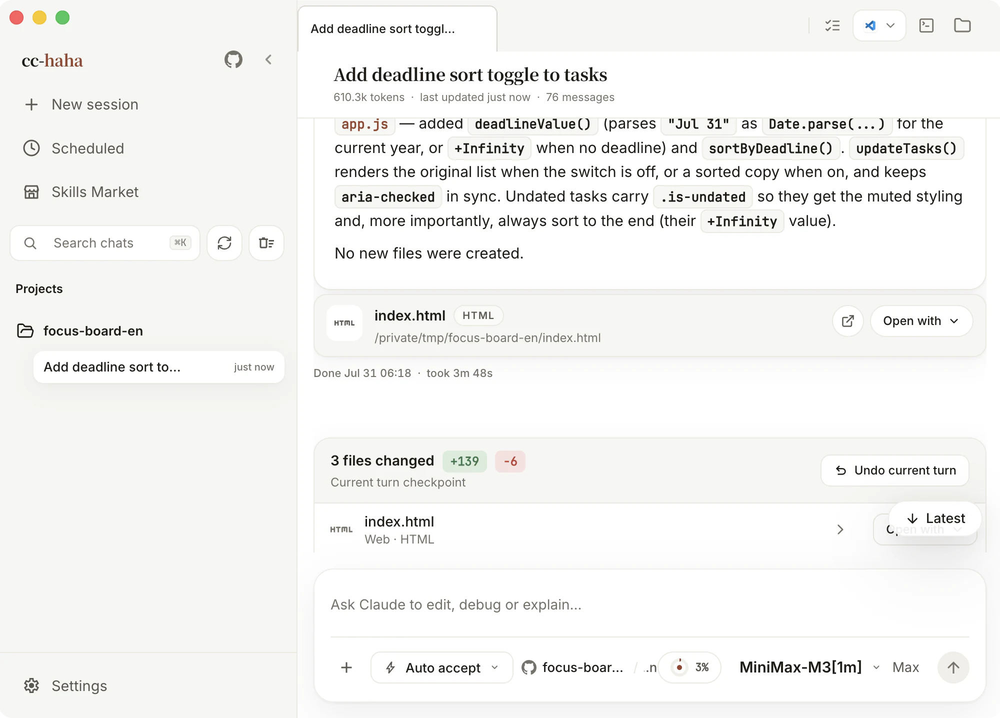
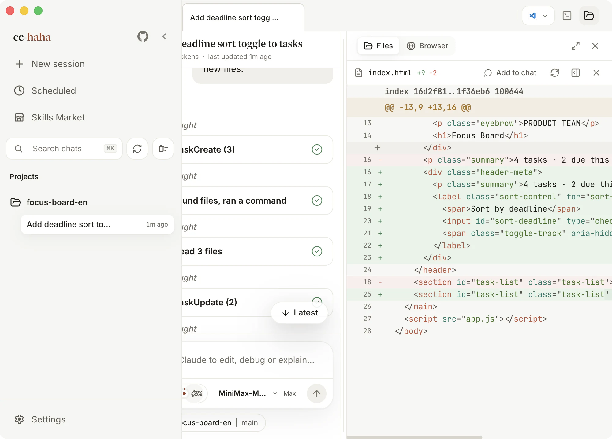
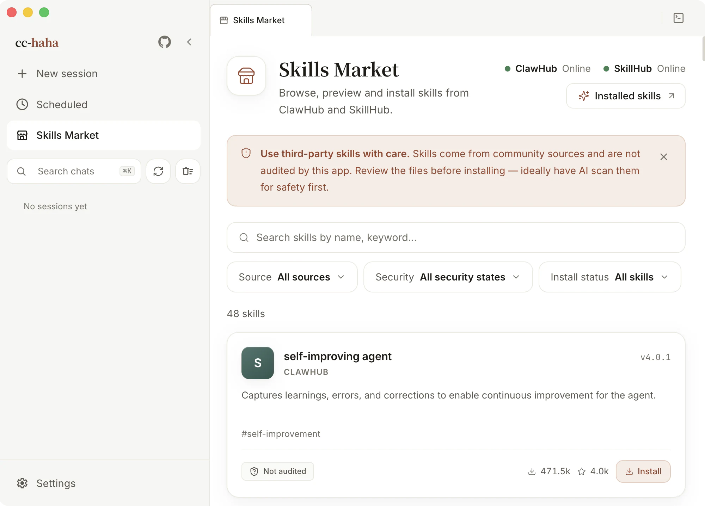

# EchoFlow Code

<p align="center">
  <picture>
    <source media="(prefers-color-scheme: dark)" srcset="docs/images/logo-horizontal-dark.svg">
    
  </picture>
</p>

<div align="center">

[](https://github.com/LiuGuangHS/EchoFlow-ClaudeCode/stargazers)
[](https://github.com/LiuGuangHS/EchoFlow-ClaudeCode/network/members)
[](https://github.com/LiuGuangHS/EchoFlow-ClaudeCode/issues)
[](https://github.com/LiuGuangHS/EchoFlow-ClaudeCode/pulls)
[](https://github.com/LiuGuangHS/EchoFlow-ClaudeCode/blob/main/LICENSE)
[](README.zh-CN.md)
[](https://code.echoflow.cn)

**English** · [简体中文](README.zh-CN.md)

</div>

EchoFlow Code is a local coding agent workspace for real projects. It combines terminal, desktop, and IM workflows with official Claude, Anthropic-compatible models, Qingyun API, multiple agents, persistent memory, Skills, image generation, visual MCP and SubAgent management, model tracing, Computer Use, H5 remote access, and scheduled tasks.

<p align="center">
  <a href="#desktop-preview">Desktop preview</a> · <a href="#install-the-desktop-app">Install</a> · <a href="#desktop-highlights">Highlights</a> · <a href="#documentation">Documentation</a> · <a href="#community">Community</a>
</p>

## Desktop Preview

<p align="center">
  <a href="https://github.com/LiuGuangHS/EchoFlow-ClaudeCode/releases"></a>
  <a href="docs/en/start/install.md"></a>
</p>

<table>
  <tr>
    <td align="center" width="33.33%"><br><b>Start with a clear session</b><br><sub>Project and permissions stay visible</sub></td>
    <td align="center" width="33.33%"><br><b>Follow work as it runs</b><br><sub>Tool calls and progress stay in view</sub></td>
    <td align="center" width="33.33%"><br><b>Review every change</b><br><sub>Focused syntax-highlighted diffs</sub></td>
  </tr>
  <tr>
    <td align="center" width="33.33%"><br><b>Verify on the spot</b><br><sub>Open the real edited page in the app</sub></td>
    <td align="center" width="33.33%"><br><b>Choose the exact model</b><br><sub>Providers, presets, and local endpoints together</sub></td>
    <td align="center" width="33.33%"><br><b>Add the right skill</b><br><sub>Source and safety status are visible first</sub></td>
  </tr>
</table>

## Install the Desktop App

1. Download the macOS, Windows, or Linux installer from [Releases](https://github.com/LiuGuangHS/EchoFlow-ClaudeCode/releases).
2. Configure a model provider, API key, and default model in Desktop Settings.
3. Public macOS releases require signing and notarization. Draft or unsigned builds may require one-time manual approval. Unsigned Windows installers can show SmartScreen; choose “More info” then “Run anyway.” See the [installation guide](docs/en/start/install.md).

## Run the CLI from Source

```bash
bun install
cp .env.example .env
./bin/echoflow-code
```

See [environment variables](docs/en/cli/env.md) and [CLI setup](docs/en/cli/index.md) for configuration details.

## Desktop Highlights

- **Multi-session workspace and global search**: keep tabs, projects, terminal entry points, history, and cross-session search in one place.
- **Branch and Worktree launch**: choose a repository branch and use either the current working tree or an isolated Worktree.
- **Diff review and built-in preview**: review each edited file and verify the real page in the integrated browser.
- **Five permission modes**: approve risky commands, tool calls, and agent questions from the desktop UI.
- **Model and reasoning configuration**: sign in to Claude, ChatGPT, or Grok; use Qingyun, official vendor APIs, local models, or Custom; normalize reasoning controls to model capabilities.
- **Image generation**: create and edit images in chat, or configure any OpenAI-compatible Images API.
- **Visual MCP and SubAgent management**: manage MCP servers, SubAgents, models, tools, and permission modes from the UI.
- **Model tracing**: record request status and timing locally, then search and filter failed or stalled calls.
- **Skills, Computer Use, and desktop pets**: install third-party skills, authorize desktop control, and optionally enable pets.
- **H5 and IM relay**: continue a session and approve actions through a mobile browser, Telegram, Feishu, WeChat, DingTalk, or WhatsApp.
- **Scheduled tasks and usage**: run planned work in separate sessions and inspect local token trends.

## Documentation

Full documentation: <https://code.echoflow.cn>

| Area | Documents |
|------|-----------|
| Getting started | [Install](docs/en/start/install.md) · [Connect a model](docs/en/start/models.md) · [First session](docs/en/start/first-session.md) · [Troubleshooting](docs/en/start/troubleshooting.md) |
| Desktop | [Overview](docs/en/desktop/index.md) · [Computer Use](docs/en/desktop/computer-use.md) · [Pets](docs/en/desktop/pets.md) · [H5 and IM relay](docs/en/desktop/remote.md) |
| CLI | [Setup](docs/en/cli/index.md) · [Reference](docs/en/cli/reference.md) · [Environment](docs/en/cli/env.md) |
| Internals | [Desktop architecture](docs/en/internals/desktop.md) · [Agents](docs/en/internals/agent.md) · [Skills](docs/en/internals/skills.md) · [Server API](docs/en/internals/server.md) · [Contributing](docs/en/internals/contributing.md) |

## Community

Report bugs, share feedback, or discuss usage through [Issues](https://github.com/LiuGuangHS/EchoFlow-ClaudeCode/issues).

## Stack

| Category | Technology |
|----------|------------|
| Language | TypeScript |
| Desktop | Electron |
| Desktop UI | React + Vite |
| Local runtime | [Bun](https://bun.sh) |
| Terminal UI | React + [Ink](https://github.com/vadimdemedes/ink) |
| CLI parsing | Commander.js |
| API | Anthropic SDK |
| Protocols | MCP, LSP |

## Acknowledgements

- [NanmiCoder/cc-haha](https://github.com/NanmiCoder/cc-haha): upstream project that continues to inform EchoFlow Code.
- [React](https://github.com/facebook/react): UI ecosystem and component model.
- [Electron](https://github.com/electron/electron): cross-platform desktop capabilities.
- [cc-switch](https://github.com/farion1231/cc-switch): provider configuration references.
