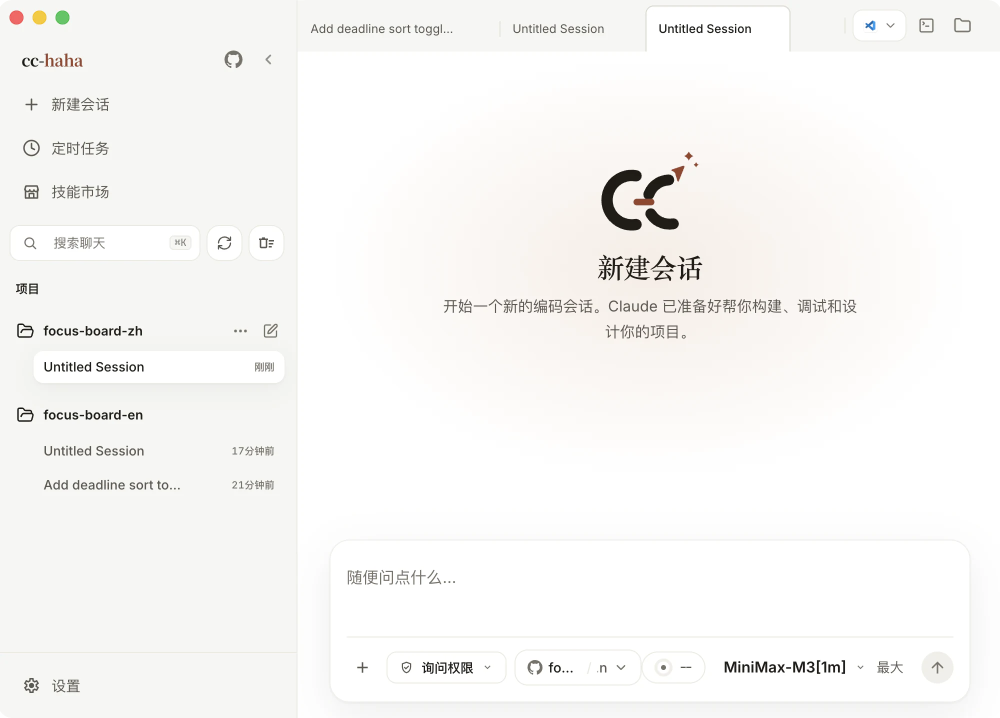
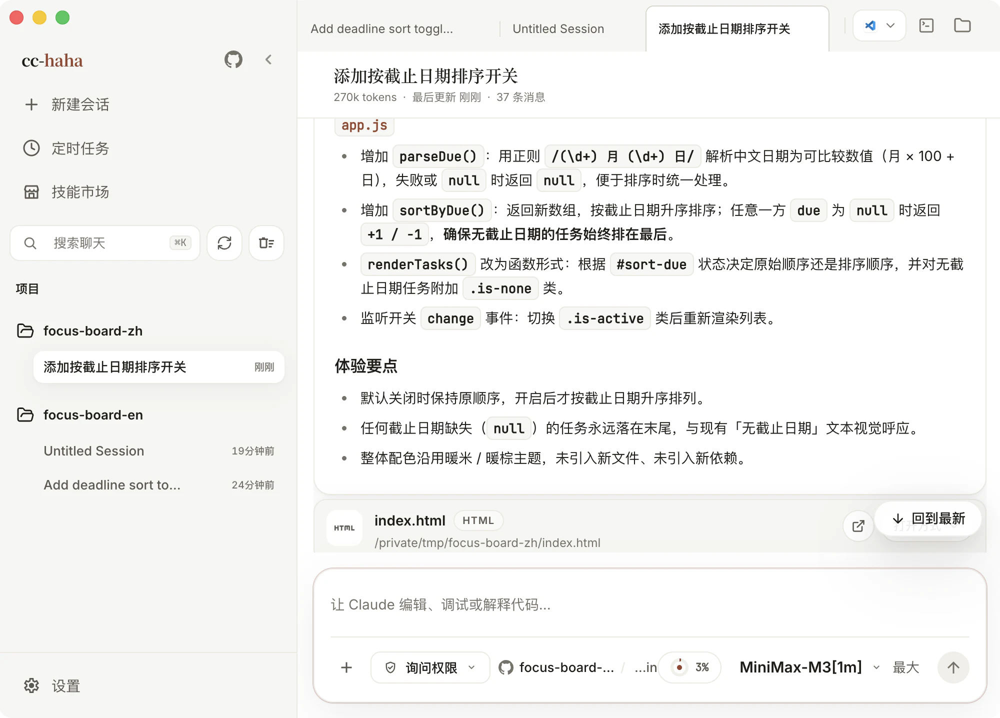

# EchoFlow Code

<p align="center">
  <picture>
    <source media="(prefers-color-scheme: dark)" srcset="docs/images/logo-horizontal-dark.svg">
    
  </picture>
</p>

<div align="center">

[](https://github.com/LiuGuangHS/EchoFlow-ClaudeCode/stargazers)
[](https://github.com/LiuGuangHS/EchoFlow-ClaudeCode/network/members)
[](https://github.com/LiuGuangHS/EchoFlow-ClaudeCode/issues)
[](https://github.com/LiuGuangHS/EchoFlow-ClaudeCode/pulls)
[](https://github.com/LiuGuangHS/EchoFlow-ClaudeCode/blob/main/LICENSE)
[](README.md)
[](https://code.echoflow.cn)

[English](README.md) · **简体中文**

</div>

EchoFlow Code 是一个**桌面端 Claude Code 工作台**：多会话与全局搜索、分支 / Worktree 启动、Diff 审阅、内置浏览器预览、图形化权限审批、Claude / ChatGPT / Grok 官方账号、官方厂商 API、本地端点、图片生成、MCP 与 SubAgent 可视化管理、Agent Teams 协作工作台、动态 Workflow 编排、模型请求追踪、Computer Use、技能市场、多主题、桌面宠物、H5 远程访问、IM 接入和定时任务，集中在一个 macOS / Windows / Linux APP 里。

<p align="center">
  <a href="#桌面端预览">桌面端预览</a> · <a href="#安装桌面端">安装桌面端</a> · <a href="#桌面端亮点">桌面端亮点</a> · <a href="#更多文档">更多文档</a> · <a href="#用户交流群">用户交流群</a>
</p>

## 桌面端预览

<p align="center">
  <a href="https://github.com/LiuGuangHS/EchoFlow-ClaudeCode/releases"></a>
  <a href="docs/start/install.md"></a>
</p>

<table>
  <tr>
    <td align="center" width="33.33%"><br><b>从清爽的空会话开始</b><br><sub>项目和权限都在首屏</sub></td>
    <td align="center" width="33.33%"><br><b>跟着任务一步步往前</b><br><sub>工具调用与阶段进度都留在眼前</sub></td>
    <td align="center" width="33.33%"><br><b>改了什么，逐行看清楚</b><br><sub>放大的高亮 Diff，文字和代码更清楚</sub></td>
  </tr>
  <tr>
    <td align="center" width="33.33%"><br><b>改完当场验证</b><br><sub>内置浏览器打开真实本地页面</sub></td>
    <td align="center" width="33.33%"><br><b>每条会话自选模型</b><br><sub>自己的服务商、预设和本地端点都在一个列表里</sub></td>
    <td align="center" width="33.33%"><br><b>缺什么手艺装什么</b><br><sub>来源和安全状态摆在明处</sub></td>
  </tr>
</table>

## 安装桌面端

1. 前往 [Releases](https://github.com/LiuGuangHS/EchoFlow-ClaudeCode/releases) 下载 macOS、Windows 或 Linux 安装包。
2. 首次启动后，在桌面端设置里配置模型服务商、API Key 和默认模型。
3. 正式 macOS Release 需要经过签名和公证；draft 或 unsigned 临时包可能需要手动放行。Windows 未签名安装包可能出现 SmartScreen 提示，点“更多信息”后选择“仍要运行”。详见[安装指南](docs/start/install.md)。

## 从源码启动 CLI

```bash
bun install
cp .env.example .env
./bin/echoflow-code
```

更多配置见[环境变量](docs/cli/env.md)和[命令行安装与启动](docs/cli/index.md)。

## 桌面端亮点

- **多会话与全局搜索**：标签页、项目切换、终端入口、会话历史和跨会话全文搜索集中管理。
- **分支 / Worktree 启动**：新会话可以选择仓库分支，并决定用当前工作树还是隔离 Worktree。
- **改动逐个文件审阅**：右侧工作区列出本轮改动，点开就是带语法高亮的 Diff，整轮可撤销。
- **内置浏览器预览**：Agent 刚改完的页面直接在应用内渲染，登录态和 Cookie 真实可用。
- **五档权限模式**：从「询问权限」到「跳过权限」，危险命令、工具调用和 AI 反问都在桌面端审批。
- **模型自选**：Claude / ChatGPT / Grok 官方账号可直接登录；DeepSeek、Kimi、智谱 GLM 等第三方 API 有现成预设；LM Studio、Ollama 的本地模型也接得上。
- **图片生成**：聊天中直接生成和编辑图片——ChatGPT / Grok 授权登录即可使用，也支持接入任意 OpenAI 兼容的 Images API。
- **MCP 图形化管理**：界面化增删改 MCP Server，支持 STDIO / Streamable HTTP / SSE 三种传输方式与项目私有、共享、全局三种作用域。
- **六套配色主题**：纯白、纸墨、经典暖色、青瓷、墨夜、墨夜蓝，可跟随系统深浅色自动切换。
- **技能市场**：发现、预览、安装 ClawHub / SkillHub 的第三方技能，来源和安全状态摆在明处。
- **会话活动面板**：集中查看任务进度、后台任务、SubAgent 与来源。
- **可视化 SubAgent 管理**：图形界面创建和调校子代理，选择模型、工具与权限模式。
- **Agent Teams 协作工作台**：桌面端可视化多 Agent 协作团队——成员、任务、通信流和依赖泳道一目了然。
- **动态 Workflow 编排**：模型当场编写并运行编排脚本，并发或流水线调度多个子代理，支持阶段视图、中断与断点续跑。
- **模型请求追踪**：本地记录每轮模型请求的状态与耗时，可搜索筛选，快速定位卡死或失败调用。
- **Computer Use**：让 Agent 在授权后截图、点击、输入并控制桌面应用。
- **桌面宠物**：搭搭、弧弧、补补、回回随任务状态换动作，也能自己做一只（默认关闭）。
- **H5 远程访问**：扫码用手机浏览器接入当前会话，锁屏切后台都不打断正在跑的任务。
- **IM 接入**：通过 Telegram / 飞书 / 微信 / 钉钉 / WhatsApp 远程对话、切换项目和审批权限。
- **定时任务与用量统计**：创建计划任务在独立会话执行，并查看本机 Token 使用趋势。

---

## 更多文档

完整文档站：<https://code.echoflow.cn>

| 分区 | 文档 |
|------|------|
| 开始使用 | [下载与安装](docs/start/install.md) · [连接模型服务](docs/start/models.md) · [跑通第一条会话](docs/start/first-session.md) · [故障排查](docs/start/troubleshooting.md) |
| 桌面端功能 | [功能总览](docs/desktop/index.md) · [Computer Use](docs/desktop/computer-use.md) · [桌面宠物](docs/desktop/pets.md) · [手机 H5 与 IM 接力](docs/desktop/remote.md) |
| 命令行 | [安装与启动](docs/cli/index.md) · [命令参考](docs/cli/reference.md) · [环境变量](docs/cli/env.md) |
| 深入原理 | [桌面端架构](docs/internals/desktop.md) · [多 Agent 系统](docs/internals/agent.md) · [Skills 系统](docs/internals/skills.md) · [本地 Server 与 API](docs/internals/server.md) · [参与贡献与质量门禁](docs/internals/contributing.md) |

## 用户交流群

使用过程中有问题、想反馈 Bug，或想交流实践，欢迎通过 [Issues](https://github.com/LiuGuangHS/EchoFlow-ClaudeCode/issues) 联系。

## 技术栈

| 类别 | 技术 |
|------|------|
| 语言 | TypeScript |
| 桌面 APP | Electron |
| 桌面 UI | React + Vite |
| 本地运行时 | [Bun](https://bun.sh) |
| 终端 UI | React + [Ink](https://github.com/vadimdemedes/ink) |
| CLI 解析 | Commander.js |
| API | Anthropic SDK |
| 协议 | MCP, LSP |

## 致谢

- [NanmiCoder/cc-haha](https://github.com/NanmiCoder/cc-haha)：上游项目，为 EchoFlow Code 的持续迭代提供基础。
- [React](https://github.com/facebook/react)：前端工程与组件化 UI 生态。
- [Electron](https://github.com/electron/electron)：跨端桌面应用能力与工程实践。
- [cc-switch](https://github.com/farion1231/cc-switch)：模型供应商配置能力参考。
