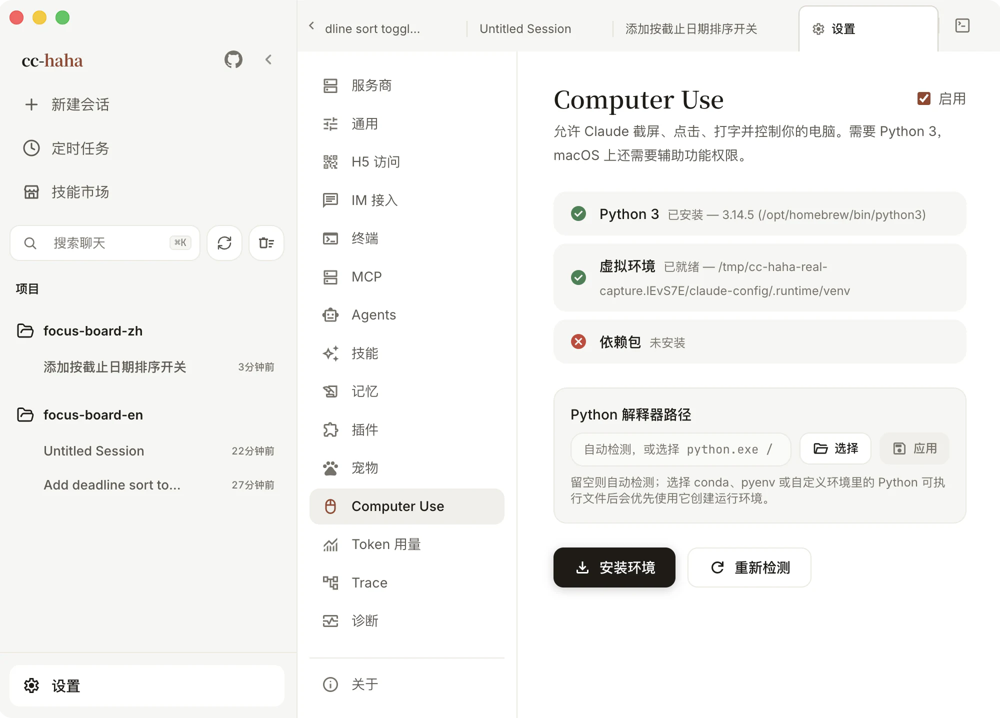

# Computer Use

开了 Computer Use，Claude 就能截屏看你的屏幕、移动鼠标、点击、输入文字，去操作那些没有 API 的应用——系统设置、原生笔记、Finder、第三方桌面软件都行。

它直接作用于你这台电脑，所以开之前请先看清楚要授权什么。

支持 macOS 和 Windows。Linux 暂无执行器。要拿到**后台操作**的完整体验需要 macOS 14.4 及以上，原因见下面「Windows 有什么不同」。

## 准备环境



打开 设置 → Computer Use，页面顶部是一排环境检查：

1. **Python 3** — 需要本机装了 Python 3。没检测到时点「下载 Python 3」去装。装在 conda、pyenv 或其他自定义环境里的话，在「Python 解释器路径」里手动选可执行文件，之后会优先用它。
2. **虚拟环境** 和 **依赖包** — 点「安装环境」，应用会自己建一个隔离的 venv 并装好平台依赖，不污染你的全局 Python。
3. 全绿以后页面会显示「所有检查通过，Computer Use 已就绪」。

装完可以随时点「重新检测」核对状态。

## macOS 的两项系统授权

macOS 上还需要两个系统权限，缺一个都用不了：

| 权限 | 用来干什么 |
|---|---|
| 辅助功能 | 移动鼠标、点击、输入文字 |
| 屏幕录制 | 截屏，也就是「让它看见」 |

页面上有「打开辅助功能设置」和「打开屏幕录制设置」两个按钮，直接跳到系统设置对应位置。

:::warning
授权之后必须**完全退出并重新打开应用**才会生效。macOS 只在进程启动时读一次权限，不重启的话页面上会一直显示未授权。
:::

授权时注意勾的是真正启动 EchoFlow Code 的那个 App。屏幕录制的自动检测偶尔不稳定，如果系统设置里明明已经勾上、页面却还显示未授权，通常直接用就行。

## 开启时的一次全局确认

**0.5.5 起取消了「每次控制一个新应用都要弹窗」的逐应用授权。** 现在改成开启 Computer Use 时做**一次全局确认**：勾上「启用」会弹出风险说明，读完后点「确认开启」。

风险说明里写清了你会接受什么，其中三条最值得注意：

- Claude 可以截取屏幕画面，可能看到屏幕上的敏感或隐私信息。
- Claude 可以点击、输入、使用剪贴板和系统快捷键，也可能发送、修改或删除内容。
- **开启后 Claude 可以直接控制所有受支持的应用，不再逐个请求 App 权限**；产品的安全限制仍然生效。

关闭方式有两条：随时在会话里停止或按 `Esc` 中断当前控制，或者回到这里关掉 Computer Use。关掉之后**新会话不会注入 computer-use MCP**，桌面控制工具也不会再暴露给 Coding Agent。

设置页里仍保留「**已授权应用**」列表和一个搜索框。它的作用从「逐个批准」变成了「预先声明」——把常用的应用勾上，需要控制它们时不会再有任何确认步骤。

另外两个开关是单独的，不会因为开了 Computer Use 就自动获得：

- **剪贴板访问** — 读写系统剪贴板。
- **系统快捷键** — 发送系统级组合键。

:::danger
开了全局确认之后就没有逐次拦截了，所以边界要靠你自己划。密码管理器、银行 App、企业 IM 这类应用请慎重——不要把它们长期留在可控制范围内。
:::

## 开始用

新建一条会话，用自然语言说清目标和允许操作的应用。从简单、可撤销的任务起步：

```text
截取当前屏幕并告诉我你看到了什么。
打开「备忘录」，新建一条标题为「测试」的空白笔记。
帮我在系统设置里找到「显示器」那一页，但什么都不要改。
```

Claude 的工作方式是「读界面 → 判断 → 操作 → 再读一次」，所以它会比人慢，也会偶尔点错。给它明确的边界（「只在 X 应用里操作」「不要保存」）比给它一个笼统目标更靠谱。

同一时间只能有一条会话控制鼠标键盘。看到「正在被其他会话使用」时，先停掉或跑完那条会话。

## 后台操作：不占用你的鼠标键盘

macOS 上 Claude 可以**在后台**点击、输入、滚动和拖拽——你继续用其他应用，两边互不干扰。

- **独立的虚拟光标** — 屏幕上有一个动画光标展示 Agent 在做什么，它和你的真实指针是两回事，不会把你的鼠标拽走。
- **遮挡下仍然看得见** — 目标窗口被别的应用盖住时，仍能持续拿到新画面。
- **成批执行** — 原生操作由常驻工作进程执行，已知动作可以连续做完，不必每个动作都等一次模型往返。
- **随时可取消** — 取消能贯穿后台进程，不会出现点了没反应。

### Windows 有什么不同

**Windows 上仍会使用系统鼠标键盘**——后台输入体验是 macOS 独有的能力。如果你在 Windows 上试了觉得"没生效"，这是原因，不是故障。

Windows 的输入可靠性、目标校验和虚拟光标一致性在这一版也有改进，但这几项后台能力不包含在内。

## 已知边界

- **界面变了要重新读一次。** 页面变化之后不能沿用旧坐标。
- **Windows 截图不过滤窗口。** macOS 的截图只保留已授权应用和桌面，Windows 上所有可见窗口都会进画面。开始前请关掉或最小化含敏感信息的窗口。
- **浏览器和终端里的操作受限。** 浏览器只允许读（能看见但不能点），终端和 IDE 只允许点击（不能输入）。要操作网页请用浏览器扩展，要跑命令请让它用 Bash 工具。

## 排查

**页面一直提示缺少权限**
确认授权的是实际启动应用的那个 App，完全退出后重开，再点「重新检测」。

**环境装不上**
在「Python 解释器路径」里明确选一个 Python 3，确认它支持 `venv`，重新点「安装环境」。还不行就去 设置 → 诊断 看安装日志。

**能截图但点不动**
确认目标应用在允许范围内，并且它现在是前台窗口。浏览器和终端类应用受上面说的分级限制。

**Windows 上没有后台操作**
正常现象。后台点击和输入是 macOS 独有能力，Windows 会接管你的系统鼠标键盘。

想了解权限分级、原生执行器和 Python 桥接的实现，看[Computer Use 架构](../internals/computer-use.md)。
