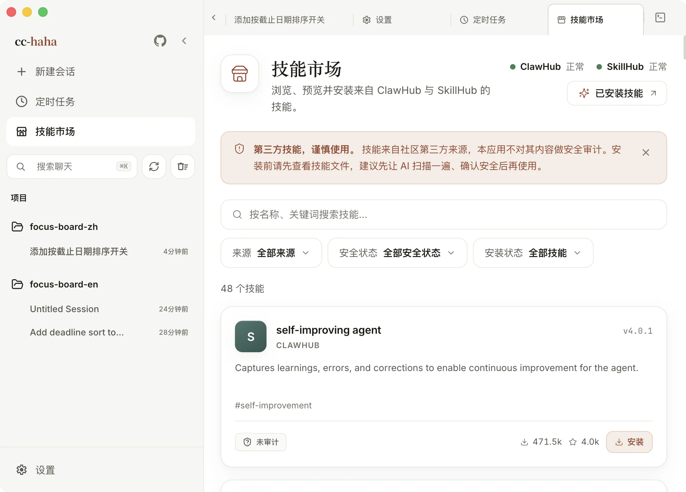

# 技能与技能市场

技能是别人写好的一套做法，装上以后 Claude 遇到对应场景就会照着做。比如一个「PDF 处理」技能会告诉它用哪个库、按什么顺序拆页、遇到加密文件怎么办——不用你每次都重新交代一遍。

**和 Agent 的区别**：Agent 是一个会干活的分身，有自己的上下文和工具范围；技能是一段知识和流程，被 Agent 加载来用。派 Agent 是「找个人去办」，装技能是「给他一本手册」。

**和连接器的区别**：连接器是通往第三方服务的通道，必须先授权账号；技能装上就能用。这一页只讲技能，连接器见 [连接器](./connectors.md)。

## 技能·连接器

点侧边栏的「**技能·连接器**」。这个页面同时管两件事——上面是服务连接器，下面是技能市场。技能标签页就是**一份纯粹的市场列表**，不再有单独的「精选技能」栏目。

市场同时聚合 **ClawHub** 和 **SkillHub** 两个来源，列表往下滚会自动加载更多，没有「加载更多」按钮。

顶部三个筛选：

- **来源** — 全部 / ClawHub / SkillHub。
- **安全状态** — 见下。
- **安装状态** — 全部技能 / 已安装 / 未安装。

搜索框按名称和关键词搜。

### 安全徽标怎么读

每张卡片右上角有一个安全标记，它反映的是**来源方**的扫描结果，不是本应用的审计结论：

| 徽标 | 含义 |
|---|---|
| 已认证 | 发布者已认证，且通过来源方安全扫描 |
| 扫描无风险 | 来源方安全扫描未发现风险 |
| 未审计 | 来源方没提供安全审计数据 |
| 存在风险 | 来源方扫描标记它有潜在风险 |

「未审计」不等于不安全，只是没人查过。「存在风险」的技能除非你自己看懂了它在干什么，否则别装。

## 安装之前

技能会带来新的工具、脚本和外部依赖，装上以后 Claude 就可能去执行它们。市场页面顶部那条免责声明说的是实话：这些技能来自社区第三方来源，本应用不对内容做安全审计。

安装前建议：

1. 在详情页切到「文件」标签，把 `SKILL.md` 和配套脚本读一遍。
2. 拿不准就让 Claude 先扫一遍——「帮我看看这个技能的文件里有没有可疑的东西」。
3. 确认你真的需要它。装得多不等于更强，每个技能都会占上下文。

点「安装」会弹确认框，里面写清了安装位置、安全提示和「安装完成后，技能将在新会话中生效」。**已经开着的会话不会立刻拿到新技能**，需要新建一条（对比：连接器连上之后，当前会话会即时刷新出它的技能和工具，见[连接器](./connectors.md)）。

卸载在同一个位置，会删掉本地对应目录下的文件。

## 已安装的技能

设置 → 技能 里能看到本机所有可用技能，按来源分组：

- **用户** — 你装的，在 `~/.claude/skills/`。
- **项目** — 跟着仓库来的。
- **插件** — 某个插件打包带来的。
- **内置** — 应用自带的。

每条会显示入口文件、文件数和预估 token 占用。点进去可以在「文档模式」和「代码模式」之间切换，直接读技能的正文和源码文件。

### `.agents/skills` 跨客户端约定

除了 `~/.claude/skills/`，桌面端也会读 `~/.agents/skills/`。这是一个开放标准目录，Codex、Cursor、Gemini CLI 等客户端共享同一份技能——装一次，几个工具都能用。来自这个目录的技能在列表里会带一个 `.agents` 标记。

项目里的 `.agents/skills/` 同理，随仓库分发，不是你自己装的。

:::warning
跨客户端目录意味着别的工具装的技能这里也会生效。定期扫一眼 设置 → 技能 的列表，确认里面没有你不认识的东西。
:::

## 在会话里引用

输入框里 `@` 和 `/` 都能引用插件和技能——`@` 用来把它作为上下文加进来，`/` 用来直接调起它。

输入框上方还有一个能力菜单，Skills、连接器、Agents、工作流、Agent Teams 和 Computer Use 的入口都集中在这里，**并且支持搜索**。入口多了之后，敲名字比翻菜单快。

市场里装的技能是**新会话才生效**：安装确认框会写明「安装完成后，技能将在新会话中生效」。想立刻用上，就新建一条会话。

想了解技能的加载机制和文件格式，看[技能系统原理](../internals/skills.md)。
