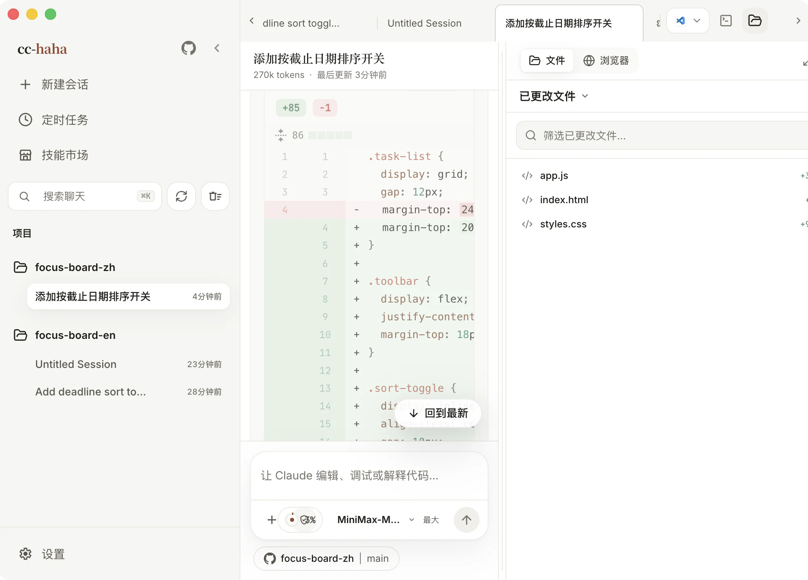
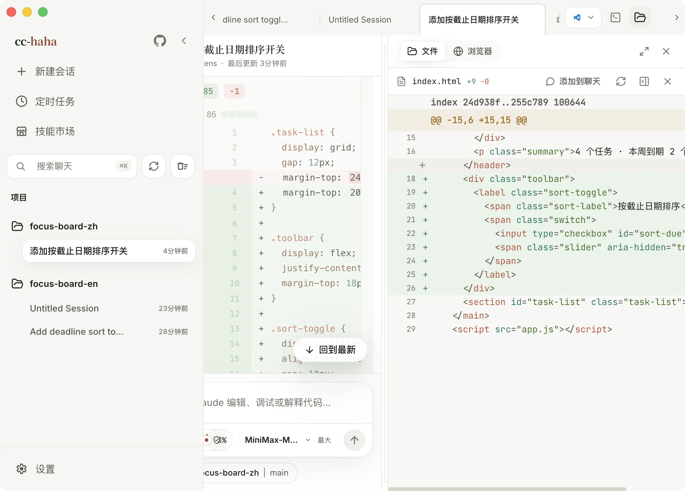
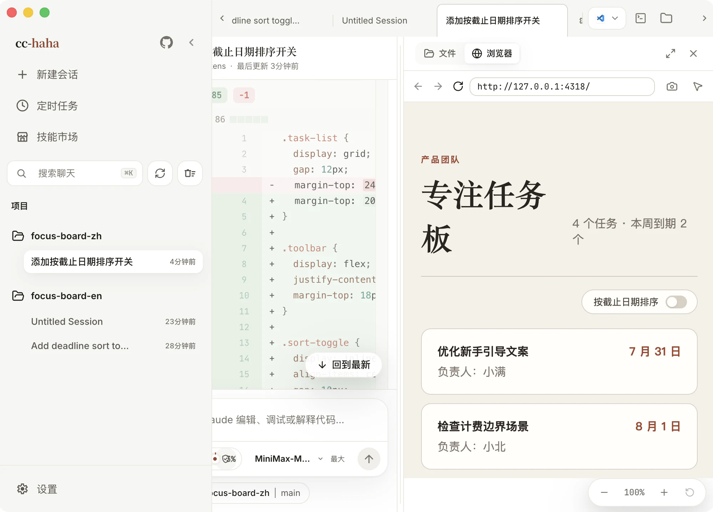

# 工作区

对话告诉你 Claude 说了什么，工作区告诉你它真的改了什么。它是右侧一块可以随时拉出来的面板，和对话并排，不用切窗口。

## 打开工作区

点标签栏右侧的文件夹图标。再点一次收起。面板左边界可以拖动改宽窄。

工作区是一组**统一的标签页**——文件、浏览器、代码审查、终端可以同时开着，不再需要「文件 / 浏览器」二选一地切来切去。

关键的一点：**收起面板或切到别的任务，标签页里正在跑的东西不会中断。** 里面开着的网页和终端继续运行，回来时还是原样。

## 标签页操作

- **拖拽排序** — 把常用标签挪到顺手的位置。
- **批量关闭** — 一次关掉多个。
- **重新打开已关闭的标签** — 关错了不用重新找。
- **重启应用后标签恢复** — 终端会以「已退出」状态回来，手动重启即可继续。

## 已更改文件 / 所有文件

文件视图里有两层：

- **已更改文件** — 只列这个 Git 仓库里当前有改动的文件，每行带状态（已修改 / 已新增 / 已删除 / 已重命名 / 未跟踪）和增删行数。这是审阅时最常待的地方。
- **所有文件** — 完整目录树。上面的搜索框可以搜整个项目的文件名，也能搜还没展开的目录。

文件树的行为是 **单击预览、双击固定常驻**。同一个文件不会重复开标签——再点一次会切到已有的那个。

不是 Git 仓库时「已更改文件」会直接说明，不是出错。

任何文件都可以右键复制路径，或者点「添加到聊天」把它作为上下文塞回输入框。输出卡片**整行可点**，中文文件名也不会再点了没反应。

## 代码审查：给某一行留话

审查界面是**显式的两侧比较**：旧行和新行并排摆开，带语法高亮，不会让你猜哪边是哪边。可以按文件暂存，也可以只暂存某个改动块。

真正有用的是行级评论：

1. 点某一行，右边出现评论框。
2. 想评一段而不是一行，按住 `Shift` 点起止行——只能选同一侧、同一变更块里的连续行。
3. 写下你希望这里怎么改，点「提交」。
4. 评论会连同文件路径、行号和那几行代码一起回到输入框，直接发给 Claude。

这比在对话里描述「那个函数里判断空值那行」准确得多。

如果你在写评论的过程中 Claude 又改了这个文件，界面会提示差异已更新，需要重新选行——这是防止评论落到错误的位置。

**还原改动之前会先存一份副本**，误点了也还有得救。

:::tip
被拒绝的工具调用不会写盘，也就不会出现在已更改文件里。交付前还是建议自己再过一遍 `git diff`。
:::

## 终端

内嵌终端是工作区里的一个标签页，可以在**侧边和底部之间移动**而不中断里面正在跑的命令。

**配色跟随当前主题**——浅色主题下不再是黑底白字。重启应用后终端以「已退出」状态回来，点一下就能重新启动。

## 独立工作树：把试验关在笼子里

在输入框的运行位置里可以选「独立工作树」。选了以后，这条会话会拿到一个隔离的 Git worktree，Claude 的所有改动都发生在那里，你当前分支和工作目录一个字都不会动。

什么时候用它：

- 想让 Claude 大改一版，但不确定要不要留。
- 当前目录有未提交的改动，直接切分支会被 Git 拦住。
- 目标分支已经在别的工作树里检出了。

会话结束后临时工作区会被清理，历史记录仍然可以看，但那时想继续就得回原项目新建会话——界面会提示你。

## 内置浏览器

在工作区里开一个浏览器标签页，地址栏里填本地开发地址或者任意网址就能预览。地址栏**支持历史建议**，敲几个字符会带出访问过的地址。窗口菜单是**系统原生弹窗**，打开时网页保持可见，不会被自己的菜单盖住。

页面里点开的新窗口链接，会在**当前任务内开成后台标签**，不会跳出去抢你的视线。

这里有三个专门为「让 Claude 看见」设计的按钮：

- **截图** — 把当前页面画面带回会话，Claude 就能看到渲染结果。
- **选择元素** — 在页面上点一个元素，它的选择器、位置和截图会一起作为上下文交给 Claude。改样式时特别省事。支持批量选择多个元素。
- **缩放** — 调预览比例，看响应式布局。

浏览器里的登录态和 Cookie 和普通浏览器一样是真实的。做公开演示或者截图发出去之前，请换成不需要登录的页面。
