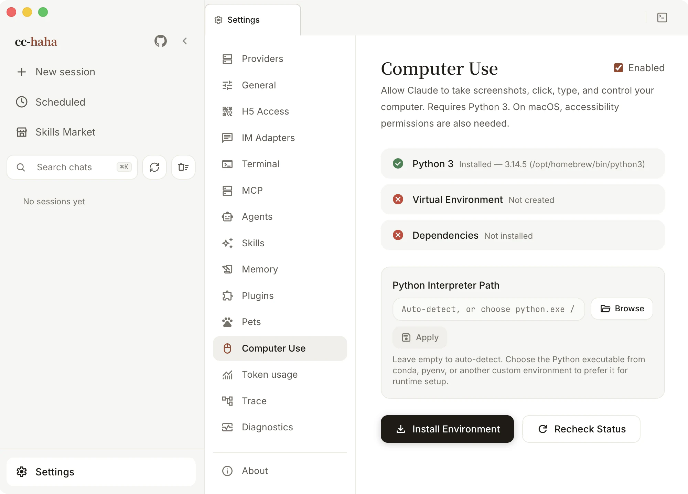

# Computer Use

With Computer Use enabled, Claude can take screenshots of your screen, move the mouse, click, and type — driving applications that have no API at all: system settings, native note apps, Finder, third-party desktop software.

It acts on this computer, so read what you're authorizing before you turn it on.

macOS and Windows are supported. There is no Linux executor yet. The full **background-operation** experience needs macOS 14.4 or newer — see "How Windows differs" below.

## Preparing the environment



Open **Settings → Computer Use**. The top of the page is a row of environment checks:

1. **Python 3** — required on your machine. If it isn't found, click **Download Python 3**. If your Python lives in conda, pyenv, or another custom environment, pick the executable under **Python interpreter path** and it will be preferred from then on.
2. **Virtual environment** and **Dependencies** — click **Install Environment** and the app creates an isolated venv and installs the platform dependencies. Your global Python is left alone.
3. When everything is green the page says all checks passed and Computer Use is ready.

**Re-check** re-runs the detection at any time.

## The two macOS permissions

macOS additionally requires two system permissions. Neither is optional:

| Permission | What it's for |
|---|---|
| Accessibility | Moving the mouse, clicking, typing |
| Screen Recording | Taking screenshots — i.e. letting it see |

The page has **Open accessibility settings** and **Open screen recording settings** buttons that jump straight to the right pane.

:::warning
After granting either one you must **fully quit and reopen the app**. macOS reads these permissions once at process start, so without a restart the page will keep reporting them as not granted.
:::

Make sure you're granting the permission to the app that actually launches EchoFlow Code. Screen Recording detection is occasionally unreliable — if the system settings clearly show it granted but the page still says otherwise, it generally works anyway.

## One global consent when you enable it

**As of 0.5.5, the per-app prompt for every new app is gone.** What replaces it is **a single global consent** when you enable Computer Use: ticking **Enable** raises a risk summary, and you click **Confirm and enable** after reading it.

That summary states what you are accepting. Three points matter most:

- Claude can capture your screen and may see sensitive or private information on it.
- Claude can click, type, use the clipboard and system shortcuts, and can send, modify, or delete content.
- **Once enabled, Claude can control all supported apps directly without asking per app**; product safety limits still apply.

There are two ways out: stop or press `Esc` in the session to interrupt control, or turn Computer Use off here. With it off, **new sessions do not inject the computer-use MCP**, and desktop-control tools are not exposed to the coding agent.

Settings still keeps an **Authorized Apps** list with a search box. Its role has changed from "approve one at a time" to "declare up front" — tick the apps you use constantly and there will be no confirmation step when they're needed.

Two more grants are separate and never come along with enabling Computer Use:

- **Clipboard access** — reading and writing the system clipboard.
- **System key combos** — sending system-level shortcuts.

:::danger
With the global consent there is no per-request interception left, so the boundary is yours to draw. Be careful with password managers, banking apps, and corporate chat — don't leave them permanently controllable.
:::

## Getting started

Start a session and describe the goal and the allowed apps in plain language. Begin with something small and reversible:

```text
Take a screenshot and tell me what you see.
Open Notes and create an empty note titled "test".
Find the Displays pane in System Settings, but don't change anything.
```

Claude works in a screenshot → decide → act → screenshot loop, so it's slower than you are and will occasionally misclick. Explicit boundaries ("only inside app X", "don't save") work far better than a broad goal.

Only one session can drive the mouse and keyboard at a time. If you see that another session holds it, stop or finish that session first.

## Background operation: it doesn't take over your input

On macOS, Claude can click, type, scroll and drag **in the background** while you keep working in other applications.

- **An independent virtual cursor** shows what the agent is doing on screen. It is separate from your real pointer, which never gets pulled away.
- **Occlusion-proof** — the target window stays capturable while another app covers it.
- **Batched execution** — native actions run in a long-lived worker process, so known operations complete back to back instead of waiting for a model round trip each time.
- **Cancellable at any point** — cancellation propagates through the worker rather than silently failing.

### How Windows differs

**On Windows the system mouse and keyboard are still used** — background input is a macOS-only capability. If you try this on Windows and it seems not to work, that is why, not a fault.

Windows did gain more reliable input handling, target validation, and a consistent virtual cursor in this release, but those background capabilities are not part of it.

## Known limits

- **Re-read the UI after it changes.** Old coordinates don't survive a page change.
- **Windows screenshots aren't filtered.** On macOS a screenshot keeps only authorized apps and the desktop; on Windows every visible window is captured. Close or minimize anything sensitive first.
- **Browsers and terminals are restricted.** Browsers are read-only (visible but not clickable) and terminals and IDEs are click-only (no typing). Use the browser extension for web pages and the Bash tool for commands.

## Troubleshooting

**The page keeps saying permissions are missing**
Confirm you granted them to the app that actually launches EchoFlow Code, fully quit and reopen, then click **Re-check**.

**The environment won't install**
Pick an explicit Python 3 under **Python interpreter path**, confirm it supports `venv`, and click **Install Environment** again. If it still fails, check the install log in **Settings → Diagnostics**.

**Screenshots work but clicks don't**
Make sure the target app is within the allowed set and is currently in the foreground. Browsers and terminals are subject to the tier restrictions above.

**Background operation doesn't work on Windows**
Expected. Background clicking and typing are macOS-only; on Windows the app uses your system mouse and keyboard.

For the permission tiers, the native executor, and the Python bridge, see [Computer Use architecture](../internals/computer-use.md).
