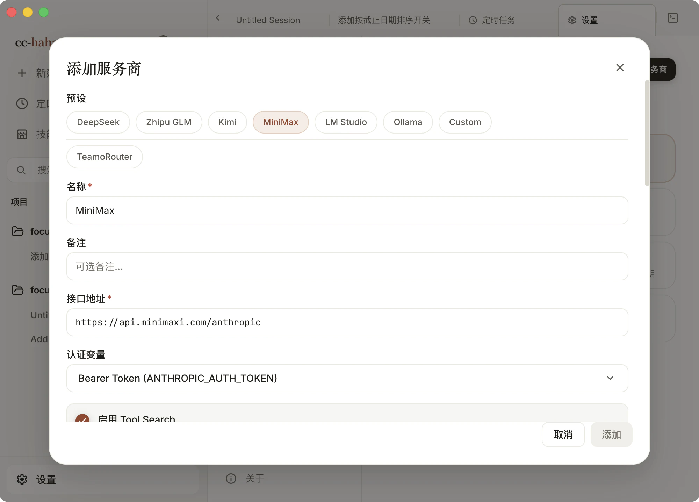

# 连接模型服务

EchoFlow Code 自己不带模型，它只是那个替你干活的壳。装完之后第一件事，是给它接一个能思考的大脑。

点侧边栏最底部的「设置」，选左边第一栏「**模型配置**」（旧版叫「服务商」）。接下来你有四条路：

- **有 EchoFlow 官方账号** — 绑定账号后选一枚调用令牌就能建渠道，不用自己申请厂商密钥。见[绑定 EchoFlow 官方账户](./account.md)。
- **有官方账号** — Claude、ChatGPT、Grok 三张内置卡，点一下走浏览器登录，不用填 API 密钥。
- **有第三方 API 密钥** — DeepSeek、Kimi、智谱 GLM 这些都有现成预设，填个密钥就能用。
- **想完全免费** — 本机跑 LM Studio 或 Ollama，模型在你自己的显卡上，一分钱不花，断网也能用。

几条路可以同时配好，在模型配置列表里随时切换。这里切换的是共享的模型配置；它不等于切换会话的执行运行时。每条会话还可以单独选择模型和推理强度，但这些选择只形成会话级覆盖，不会创建或替换运行时专属的配置。

## 官方账号登录

「设置 → 模型配置」页面顶部有三张卡：

| 卡片 | 需要什么 |
|---|---|
| **Claude 官方** | 一个 Claude.ai 账号（Pro / Max 订阅，或有额度的 API 账号） |
| **ChatGPT 官方** | 一个 ChatGPT 账号，走 OpenAI OAuth |
| **Grok 官方** | 一个 xAI 账号，走 Grok 官方 OAuth |

点卡片上的登录按钮（「登录 Claude 账号」/「登录 ChatGPT」/「登录 Grok」），系统浏览器会打开对应的授权页面。用同一个账号完成授权后，浏览器会自动跳回应用，卡片上显示「已登录」。

三条注意事项：

- 授权全程别关掉 EchoFlow Code，回调要落回正在运行的应用。
- 浏览器没自动打开，就点「复制授权链接」，自己粘到浏览器里。
- 挂了代理或装了拦截类扩展时，授权页和本机回调都可能被挡住。授权失败先把它们关掉再试。

登录之后能用哪些模型，取决于你的账号权限和订阅档位——文档里出现过某个模型名，不代表你的账号一定能调。

## 第三方 API 服务商

有 API 密钥的话，这条路最省事：点「添加模型」，在「预设」里选一个，接口地址和默认模型会自动填好，你只需要粘贴密钥。

内置预设（按弹窗里的排列）：

- **EchoFlow API** — EchoFlow 自有服务入口，配合[官方账户](./account.md)使用。
- **DeepSeek** · **Zhipu GLM** · **Kimi** · **MiniMax** — 官方模型厂商 API，接口地址是各家的 Anthropic 兼容端点。
- **OpenCode Go** — 官方订阅服务。填入订阅密钥后可用 GLM、Kimi、MiniMax、Qwen、Grok、GPT 等模型，网关按模型族自动选择协议端点，不需要手动配。
- **LM Studio** · **Ollama** — 官方本地模型集成，见下一节。
- **Custom** — 上面都没有，自己填。私有网关也走这一项。

选中预设后，如果这家服务商有申请密钥的页面，密钥输入框下面会出现一颗「获取 API Key」按钮，点开就是注册/取密钥的地址。

## 本地模型

想彻底不花钱、不联网，就在本机跑一个模型服务，让应用连过去。

**LM Studio**：在 LM Studio 里加载好模型并启动本地服务器，然后在「添加模型」里选 `LM Studio` 预设，接口地址填 `http://localhost:1234`。

**Ollama**：`ollama serve` 起来之后，选 `Ollama` 预设，接口地址填 `http://localhost:11434`。

连接时注意两点：

1. **接口地址后面不要加 `/v1`。** 这两家都提供 Anthropic 兼容协议，应用走的是那条路径，多加 `/v1` 会直接 404。
2. **按模型实际支持的大小配置上下文窗口。** 200K 不是统一的最低门槛；窗口需要容纳系统提示词、工具定义、已加载的 Skills 和当前任务。较小窗口可能容纳不下这些内容，长任务也更容易触发压缩。服务端的实际窗口在 LM Studio 或 Ollama 自己的模型配置里设置，不要声明超出实际支持范围的数值。

本地模型能否完成 Agent 工作流，取决于模型的工具调用能力、接口兼容性、配置和任务。如果出现只输出文字却不调用工具，应结合请求、响应和工具配置排查，不能仅凭模型参数量判断原因。

## 「添加模型」弹窗逐个字段

**名称**（必填）— 显示在服务商列表里的名字。选了预设会自动填，可以改成你认得出的，比如「DeepSeek-工作号」。

**备注** — 给自己看的一句话，比如"月底到期"。不影响任何请求。

**接口地址**（必填）— 服务商的 API 根地址，不是它的官网地址。预设会自动填对。自己填的时候注意别把接口路径写重复了：如果地址里已经有 `/anthropic`，后面就不要再补 `/v1/messages`。

**认证变量** — 决定密钥以什么形式发出去，五个选项：

| 选项 | 什么时候用 |
|---|---|
| API Key (`ANTHROPIC_API_KEY`) | 直连 Anthropic 官方 API，发 `x-api-key` 头 |
| Bearer Token (`ANTHROPIC_AUTH_TOKEN`) | 绝大多数第三方 Anthropic 兼容服务，发 `Authorization: Bearer` |
| Bearer + 清空 API_KEY | OpenRouter、Ollama 这类，必须避免回退到 Anthropic 密钥 |
| 两个变量写同一个 Token | Hugging Face Router 这类同时检查两个变量的服务 |
| 两个变量写 dummy | 本地 vLLM 这类只需要占位认证值的服务 |

预设会自动选对。自己填的时候拿不准就先用 Bearer Token，401 了再换 API Key。

**启用 Tool Search**（默认开）— 开着的时候，MCP 工具和一部分工具定义按需加载，能省下首轮很大一块 schema token。但它依赖模型支持 `tool_reference`。**如果接的是能力较弱的模型，或者服务商直接拒绝这种请求形态，把它关掉。**

**关闭实验性 Beta 头** — 给这个服务商设置 `CLAUDE_CODE_DISABLE_EXPERIMENTAL_BETAS=1`。有些第三方通道见到 beta 形态的 API 请求会直接报错，勾上它就不发这些头了。**报 400 或者"不支持的参数"时优先试这个。**

**API 密钥**（必填，本地模型除外）— 从服务商控制台复制过来的密钥。粘贴时注意别带上前后的空格。密钥存在本机，不会上传到任何地方。

**模型映射** — 四个槽位，填的是**模型 ID**，不是模型的中文名：

- **主模型**（必填）— 日常对话用的模型，必须支持工具调用。
- **Haiku 模型** — 留空则跟随主模型。这个槽位承担标题生成、文件摘要这类轻量活儿，映射到一个便宜的小模型能省不少钱。
- **Sonnet 模型 / Opus 模型** — 留空则跟随主模型。用得上分档时再填。

每个槽位下面有个 `1M` 复选框，只有当这个模型确实支持一百万 token 上下文时才勾。

**API 格式** — 这一项只在选了 `Custom` 预设、或者编辑已有配置时才出现，三个选项：Anthropic Messages（原生）、OpenAI Chat Completions（代理转换）、OpenAI Responses API（代理转换）。后两种会由应用在本机起一个回环代理做协议转换，你不用自己部署任何东西。所有内置预设走的都是 Anthropic 原生，所以看不到这一项。

填完点「添加」。

## 请求兼容设置

服务商编辑页里还有一组「请求兼容设置」，用来对付那些对请求体挑食的端点。多数情况留空即可，报错时再来调。

**回复输出预算** — 普通回复请求的最大输出 token 数。留空表示自动选择；后台短请求仍会用较小的预算，不受这里影响。**填了之后不会被模型名推断出的上限压回默认值**，这是这一组设置的主要意义。

**已知端点输出上限** — 只在服务商明确给出硬上限时填。请求预算不会超过这个值。不确定就别填。

**输出 token 参数** — 上限用哪个字段发出去，以及要不要发。可选自动、支持、不支持、不发送上限。

下面还有四个能力开关，**仅对 OpenAI 兼容格式显示**：采样参数、推理参数、并行工具调用、结构化输出。端点不支持某一项时关掉它，避免发出去被拒。

这组设置只保存在当前服务商上，不写进全局配置。

## 导入已有配置

不想手打的话，有两条导入路径：

- **从 cc-switch 导入** — 如果你之前用 cc-switch 管理过 Claude Code 的服务商，可以直接读进来。已有的服务商不会被改动，导入前可以逐个勾选。
- **从 OpenAI 兼容接口取模型列表** — 填好接口地址和密钥后，让应用去拉一份可用模型，省得手动敲模型 ID。

读不到 cc-switch 配置时，界面会说明具体原因（没装、权限不够、版本太旧等），照提示处理。

## 保存之后

回到模型配置列表，对着刚加的这一条：

1. 点「测试」。Anthropic 原生格式只测一步「① 连通」；OpenAI 格式会多测一步「② 代理转换」。两步都绿了才算通。EchoFlow 官方渠道的测试走账户 + 令牌，不需要你提供完整 Key。
2. 点「设为默认」，让新会话默认用它。
3. 多条配置可以拖动排序，顺序只影响列表显示。

然后新建一条会话，**在输入框的会话配置控件里挑具体模型**——那里列出的才是当前配置真正能用的模型。模型选择器**支持搜索**，模型多的时候直接敲名字。还没配过模型时，它会引导你完成设置。

**推理强度跟随所选模型**：换模型时默认 effort 会跟着变，不确定就保持默认。

如果某条配置指向的服务商暂时连不上，**不会阻塞应用启动**——模型目录会先用缓存，等你需要时再拉最新的。

:::info
模型配置与会话的执行运行时是两件事。运行时（内置 / 已安装的 Claude Code）在「设置 → 通用」的 **Claude Code runtime** 里切换，也可以直接在会话顶部切。
:::

:::tip
测试通过不等于万事大吉。它只证明接口通、认证对，不代表这个模型能撑住工具调用和长上下文。真正的验收是发一条会真的改文件的任务，看它有没有动手。
:::

连不上、401、模型列表是空的？去 [装不上 / 打不开 / 连不上](./troubleshooting.md) 的「模型连不通」一节。

用 EchoFlow 官方账号的话，看[绑定 EchoFlow 官方账户](./account.md)。

模型接好了，就可以 [跑通第一条会话](./first-session.md) 了。
